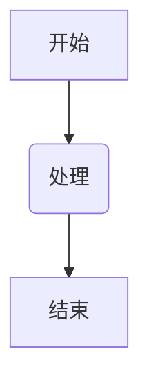
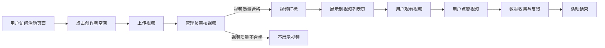

2024 年 8 月 28 日

第一钟：

OKR Review

BAT 看板作为监控

大项目的收尾工作，宣发+反馈

Figma Axure的分析

---

第二钟：

极客时间批量导入课件

极客时间单个导入课件

Axure 的初体验，原型

业务会议文档

---

第三钟：

Axure 各部分的原型设计

第四钟：

业务会议讨论

第五钟：

业务会议跟进

创作者空间的接入

---

第六钟：

iHub
企业数字化平台和程长学园联合打造的学习平台。
旨在帮助程里人提升专业技能/岗位技能，推广集团组织文化价值观，实现员工培养和发展，提升组织效能。

**学员端**：包括课程、考试、学习包、线下培训等学习资源，还有资源搜索、个人中心、创作中心、首页等模块，方便学员以各种不同的方式导航或搜索到自己关注的资源。

管理后台**：提供了对课程、考试、学习包、线下培训、证书等资源的设置和维护，同时提供了对学院、人员标签、字幕、课程分类等基础信息的维护功能。此外，ihub管理后台还提供了大量的报表功能，主要分为资源运营类和平台运营类。资源运营类主要包含课程学习情况统计和分析、考试情况统计分析、线下培训的报名和签到数据、证书持有情况和发放情况等通用类型报表。平台运营类主要按部门对学员在ihub的活动行为进行分析。

---

iHub 企业数字化平台和程长学园联合打造的学习平台。
旨在帮助程里人提升专业技能/岗位技能，推广集团组织文化价值观，实现员工培养和发展，提升组织效能。

1. 丰富学习资源：涵盖课程、考试、线下培训，全方位支持培训全生命周期。
2. 深化信息管理：个人中心轻松管理用户信息，后台模块有序维护平台资源。
3. 智能培训体验：AI学习助手助力互动式培训，自动生成封面和字幕提升培训效率。

---

第七钟：

最好的 Axure 从抽象到具象

**Conf Axure Boardmix**（Processon Drawio）

**Typora Trello ChatGPT**

graph TD
    A[开始] --> B(处理)
    B --> C[结束]

```

- 或者使用三个反引号：



```

```

---

第八钟：

工具研究 Axure Note

Daily 

微信读书