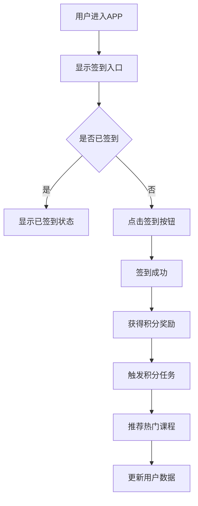
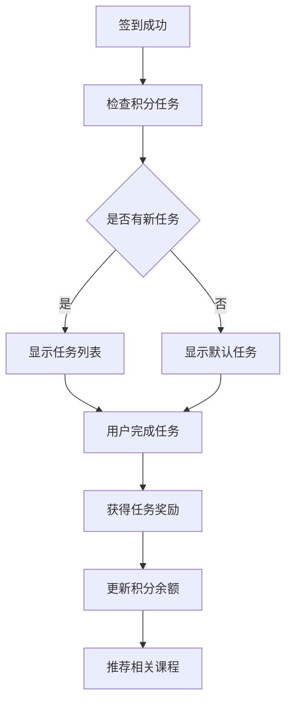

# 签到功能PRD

## 项目背景

### 愿景
通过签到功能提升用户活跃度和学习参与度，建立用户与平台的粘性连接，促进用户持续学习。

### 目标
- 提升用户日活跃度（DAU）15%
- 增加用户平均学习时长20%
- 提高课程推荐点击率25%
- 建立用户积分体系，增强用户留存

### 道路
1. 第一阶段：基础签到功能上线
2. 第二阶段：积分任务系统完善
3. 第三阶段：个性化推荐优化

## 需求分析

### 用户故事
1. **作为普通用户**，我希望每天签到获得积分奖励，这样我可以兑换学习资源
2. **作为活跃用户**，我希望连续签到获得更多奖励，这样我更有动力坚持学习
3. **作为新用户**，我希望通过签到了解热门课程，这样我可以快速找到感兴趣的内容
4. **作为平台运营**，我希望通过签到数据了解用户活跃度，这样我可以优化运营策略

### 拓展场景
- 用户在不同时间段签到（早上、中午、晚上）
- 用户连续签到7天、30天等里程碑
- 用户分享签到获得额外奖励
- 用户邀请好友签到获得团队奖励

### 极限用例
- 用户网络异常无法签到
- 用户时区不同导致签到时间差异
- 用户设备更换导致签到记录丢失
- 系统维护期间签到功能不可用

## 架构流程

### 签到流程


### 积分任务流程


## 解决方案（具体需求描述）

### 1. 签到入口设计

#### 1.1 入口位置
- **主页面顶部**：在首页顶部添加签到卡片
- **个人中心**：在个人中心页面添加签到按钮
- **底部导航**：在底部导航栏添加签到图标

#### 1.2 签到卡片设计
```
┌─────────────────────────┐
│ 📅 每日签到              │
│ ┌─┬─┬─┬─┬─┬─┬─┐        │
│ │一│二│三│四│五│六│日│        │
│ └─┴─┴─┴─┴─┴─┴─┘        │
│ 连续签到：3天            │
│ [立即签到] [查看奖励]    │
└─────────────────────────┘
```

#### 1.3 签到状态显示
- **未签到**：显示"立即签到"按钮
- **已签到**：显示"已签到 ✓"状态
- **连续签到**：显示连续签到天数

### 2. 积分奖励机制

#### 2.1 基础奖励
- **每日签到**：+10积分
- **连续签到**：每连续1天额外+2积分
- **周签到**：连续7天额外+50积分
- **月签到**：连续30天额外+200积分

#### 2.2 特殊奖励
- **首次签到**：+50积分
- **分享签到**：+5积分
- **邀请好友**：+20积分/人

#### 2.3 积分用途
- 兑换课程优惠券
- 兑换学习资料
- 兑换会员时长
- 参与积分抽奖

### 3. 积分任务系统

#### 3.1 任务类型
1. **每日任务**
   - 观看课程视频 10分钟（+5积分）
   - 完成一个练习（+10积分）
   - 分享学习心得（+8积分）

2. **每周任务**
   - 完成3个课程章节（+30积分）
   - 参与讨论区互动（+20积分）
   - 推荐课程给好友（+25积分）

3. **成就任务**
   - 连续学习7天（+100积分）
   - 完成10个课程（+500积分）
   - 获得5个证书（+300积分）

#### 3.2 任务展示
```
┌─────────────────────────┐
│ 🎯 今日任务              │
│ ┌─────────────────────┐ │
│ │ 📺 观看课程10分钟    │ │
│ │ 进度：5/10分钟      │ │
│ │ 奖励：5积分         │ │
│ └─────────────────────┘ │
│ ┌─────────────────────┐ │
│ │ ✍️ 完成一个练习      │ │
│ │ 进度：0/1个         │ │
│ │ 奖励：10积分        │ │
│ └─────────────────────┘ │
└─────────────────────────┘
```

### 4. 热门课程推荐

#### 4.1 推荐算法
- **基于用户行为**：根据用户历史学习记录推荐
- **基于热门度**：推荐当前最受欢迎的课程
- **基于时间**：推荐适合当前时间段的课程
- **基于难度**：推荐适合用户水平的课程

#### 4.2 推荐展示
```
┌─────────────────────────┐
│ 🔥 今日推荐              │
│ ┌─────────────────────┐ │
│ │ [课程封面]           │ │
│ │ Python数据分析入门   │ │
│ │ ⭐⭐⭐⭐⭐ 4.8分      │ │
│ │ 👥 2.3万人学习       │ │
│ │ 💰 限时优惠：8折     │ │
│ └─────────────────────┘ │
└─────────────────────────┘
```

#### 4.3 推荐策略
- **每日更新**：每天推荐不同的热门课程
- **个性化**：根据用户兴趣调整推荐内容
- **时效性**：推荐当前季节或热点相关的课程
- **多样性**：确保推荐内容的多样性

### 5. 技术实现

#### 5.1 数据存储
```sql
-- 用户签到记录表
CREATE TABLE user_checkin (
    id BIGINT PRIMARY KEY,
    user_id BIGINT,
    checkin_date DATE,
    checkin_time TIMESTAMP,
    continuous_days INT,
    points_earned INT,
    created_at TIMESTAMP
);

-- 积分任务表
CREATE TABLE point_tasks (
    id BIGINT PRIMARY KEY,
    task_name VARCHAR(100),
    task_type ENUM('daily', 'weekly', 'achievement'),
    points_reward INT,
    task_condition JSON,
    status ENUM('active', 'inactive')
);

-- 用户任务完成记录表
CREATE TABLE user_task_completion (
    id BIGINT PRIMARY KEY,
    user_id BIGINT,
    task_id BIGINT,
    completion_date DATE,
    points_earned INT,
    created_at TIMESTAMP
);
```

#### 5.2 API接口
```javascript
// 签到接口
POST /api/checkin
{
    "user_id": 123,
    "timestamp": "2024-01-15T08:30:00Z"
}

// 获取任务列表
GET /api/tasks?user_id=123&type=daily

// 完成任务
POST /api/tasks/complete
{
    "user_id": 123,
    "task_id": 456,
    "completion_data": {...}
}

// 获取推荐课程
GET /api/recommendations?user_id=123&type=hot
```

### 6. 运营策略

#### 6.1 活动策划
- **新用户专享**：新用户首次签到双倍积分
- **节日活动**：重要节日签到额外奖励
- **学习挑战**：连续学习挑战赛
- **积分商城**：积分兑换实物奖品

#### 6.2 数据分析
- **签到率**：每日签到用户数/总用户数
- **连续签到率**：连续签到7天用户数/总用户数
- **任务完成率**：完成任务用户数/参与任务用户数
- **推荐转化率**：点击推荐课程用户数/看到推荐用户数

### 7. 风险评估

#### 7.1 技术风险
- **并发问题**：高并发签到可能导致数据不一致
- **性能问题**：大量用户同时签到可能影响系统性能
- **数据安全**：积分系统需要防止刷积分

#### 7.2 业务风险
- **用户疲劳**：长期签到可能导致用户疲劳
- **奖励贬值**：积分过多可能导致奖励贬值
- **推荐效果**：推荐算法效果不佳可能影响用户体验

### 8. 上线计划

#### 8.1 第一阶段（MVP）
- 基础签到功能
- 简单积分奖励
- 基础任务系统
- 热门课程推荐

#### 8.2 第二阶段（优化）
- 个性化推荐
- 复杂任务系统
- 积分商城
- 数据分析优化

#### 8.3 第三阶段（完善）
- 社交功能
- 高级推荐算法
- 运营工具
- 性能优化

## 总结

签到功能作为提升用户活跃度的重要工具，通过积分奖励和任务系统激励用户持续参与学习。结合热门课程推荐，不仅能够提升用户粘性，还能促进课程销售转化。通过分阶段实施和持续优化，确保功能效果最大化。 