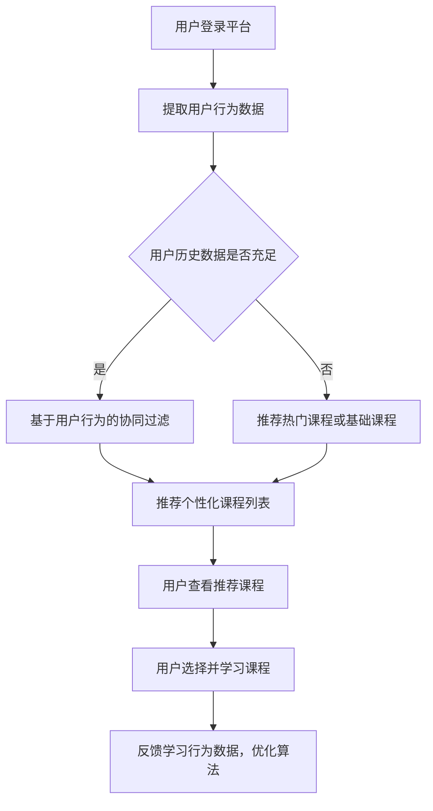

### 项目背景

#### 愿景
在线教育平台旨在提升用户的学习体验，通过精准的课程推荐，帮助用户更快速找到最适合他们的学习内容，提升平台的用户粘性和学习转化率。

#### 目标
- 实现基于用户行为的协同过滤推荐系统，提供个性化课程推荐。
- 后期引入课程的协同过滤与多臂推荐算法，优化推荐精准度。
- 提升用户对平台课程的活跃度与满意度。

#### 道路
- **第一阶段**：基于用户行为的协同过滤算法，为用户推荐相似兴趣的课程。
- **第二阶段**：扩展为基于课程相似度的协同过滤，结合课程标签、难度和适用人群等数据。
- **第三阶段**：引入多臂推荐算法，动态调整推荐策略，根据用户反馈优化推荐内容。

---

### 需求分析

#### 用户故事
1. **作为一名用户**，我希望在登录平台后，能够看到根据我的学习历史和浏览行为推荐的相关课程，以便快速找到感兴趣的学习内容。
2. **作为一名新用户**，我希望能够在填写完基础信息后，收到系统推荐的热门课程或与我职业相关的入门课程，方便我快速入门。
3. **作为一名平台管理员**，我希望能够查看推荐算法的运行效果，通过数据分析观察推荐课程是否能够提升用户活跃度与学习时长。

#### 拓展场景
- 用户未登录时，可以推荐平台的热门课程或者新上架的课程。
- 当用户课程浏览量较少时，通过与其背景信息相近的其他用户的行为进行推荐。
- 针对特定活动或推广课程，系统可以提供定向推荐。

#### 极限用例
- **数据极端稀疏**：当用户的学习行为数据很少时，推荐系统需要基于基础信息（如职业、兴趣）或平台热门课程进行推荐。
- **重复推荐问题**：当用户已经完成某些课程时，需要避免再次推荐同一课程，特别是针对完成度较高的用户。
- **无效数据处理**：如果用户点击或访问了一些课程但并未进一步学习，系统应动态调整推荐，避免反复推荐此类课程。

---

### 架构流程

#### Mermaid 流程图



#### Markdown 架构图

```markdown
+---------------------+           +-------------------------+
|   用户行为数据采集模块   | ----->  |  协同过滤推荐算法引擎     |
+---------------------+           +-------------------------+
                                       |
                                       v
                             +-------------------+
                             |  课程推荐展示模块  |
                             +-------------------+
                                       |
                                       v
                          +----------------------------+
                          |  用户学习行为反馈与调整模块  |
                          +----------------------------+
```

---

### 解决方案（具体需求描述）

1. **用户协同过滤推荐**（本期重点）
   - 基于用户的历史学习数据（课程学习记录、课程评分、浏览历史等），使用协同过滤算法为用户推荐具有相似学习行为的用户学习过的课程。
   - 系统在用户登录后自动为其生成个性化课程推荐列表，提升用户的学习效率。

2. **课程协同过滤推荐**（后期扩展）
   - 针对每门课程，根据课程标签、适用人群、难度等信息，计算出相似课程。为用户推荐与当前课程相似的学习内容，提升用户学习的连贯性与系统性。

3. **多臂推荐算法**（后期引入）
   - 动态调整推荐策略，结合用户的实时行为反馈（如点击、课程完成度、学习时长等），逐步优化推荐结果。基于多臂算法，系统能够快速识别出最受用户欢迎的推荐策略，并对其进行强化。

4. **数据处理与优化**
   - 针对冷启动问题，新用户无学习历史时，可以根据其基础信息（职业、兴趣）推荐相关课程。
   - 系统持续监测用户的学习行为，根据用户对推荐内容的反馈进行动态调整。